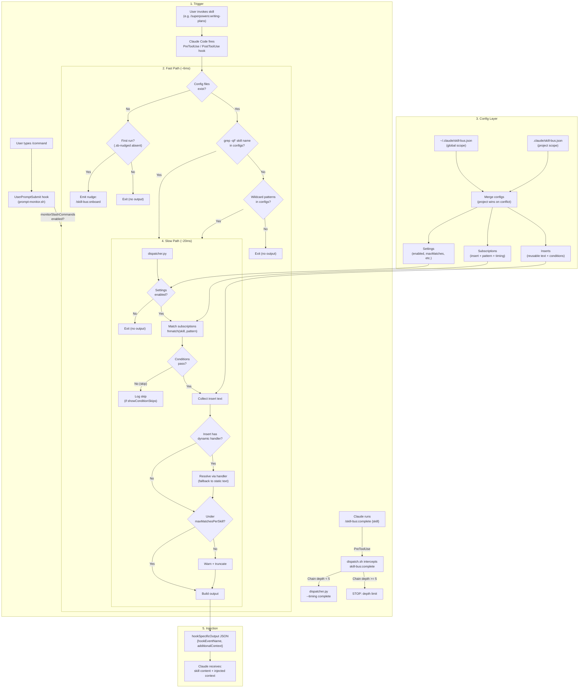
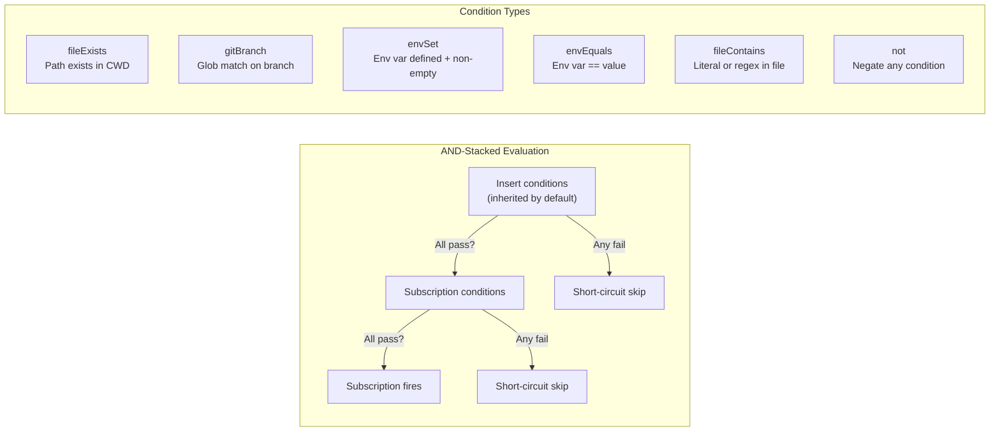
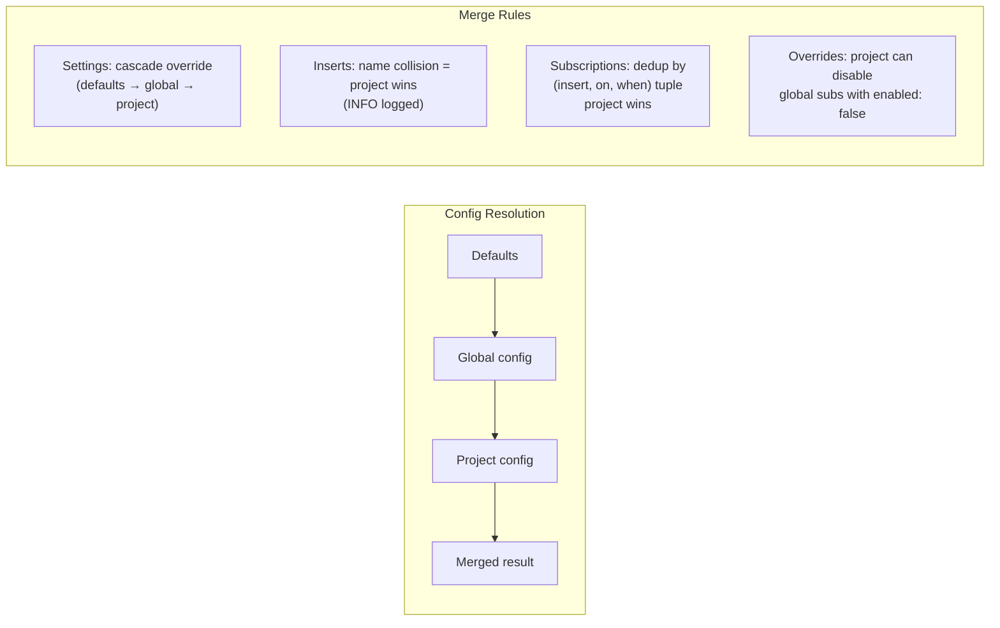
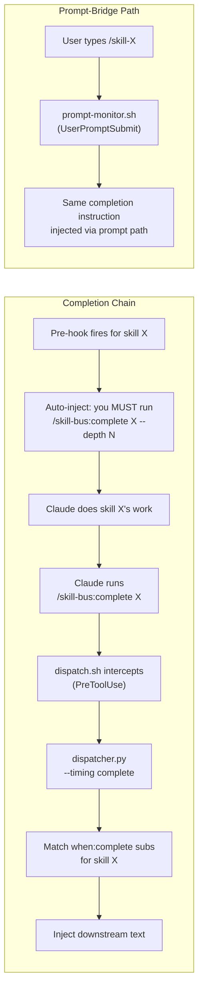

# Skill Bus Architecture

The skill for connecting skills. Wire context, conditions, and other skills into any skill invocation — declaratively, without modification.

## Architecture Flow

## Condition Evaluation

## Config Merge Model

## Key Components

| Component | File | Responsibility |
|-----------|------|----------------|
| Fast-path dispatcher | `hooks/dispatch.sh` | Bash grep filter (~6ms), avoids Python when no match possible |
| Pre-skill hook | `hooks/pre-skill.sh` | Entry point for PreToolUse events |
| Post-skill hook | `hooks/post-skill.sh` | Entry point for PostToolUse events |
| Prompt monitor | `hooks/prompt-monitor.sh` | Optional UserPromptSubmit hook for slash commands |
| Core dispatcher | `lib/dispatcher.py` | Config loading, condition eval, pattern matching, output building |
| Telemetry | `lib/telemetry.py` | JSONL event logging (`match`, `condition_skip`, `no_match`), log rotation |
| CLI | `lib/cli.py` | `list`, `simulate`, `skills`, `status`, `inserts`, `stats`, `scan`, `set`, `add-insert` subcommands |
| Onboard command | `commands/onboard.md` | Guided setup flow — discover knowledge, create subscriptions, configure settings |
| Session reflection | `skills/reflecting-on-sessions/SKILL.md` | Natural-break-point review of telemetry data and subscription gaps |

## Settings

| Setting | Default | Description |
|---------|---------|-------------|
| `enabled` | `true` | Master kill switch |
| `maxMatchesPerSkill` | `3` | Max subscriptions per skill invocation |
| `showConsoleEcho` | `true` | Show match info in console |
| `disableGlobal` | `false` | Ignore global config entirely |
| `monitorSlashCommands` | `false` | Enable prompt monitor for slash commands |
| `showConditionSkips` | `false` | Log condition-based skips |
| `telemetry` | `false` | Enable JSONL telemetry logging |
| `observeUnmatched` | `false` | Log skills with no matching subscriptions |
| `telemetryPath` | `""` | Override telemetry log path |
| `completionHooks` | `false` | *(Experimental)* Enable synthetic completion hooks |
| `maxLogSizeKB` | `512` | Max telemetry log size before rotation |

## Completion Flow (Experimental)

**Requirements:** `completionHooks: true` in settings. Prompt-bridge also requires `monitorSlashCommands: true`.

## Gotchas

- Hook timeout is 5s — if Python dispatch exceeds this, skill loads without injected context
- Fast-path grep may have false positives (skill name substring match) — slow path handles precision
- Insert name collision across scopes — project version wins (INFO logged)
- `not` condition warns on double negation (likely a mistake)
- `fileContains` skips files > 1MB to avoid timeout
- `envEquals` warns if value is numeric (should be string: `"3000"` not `3000`)
